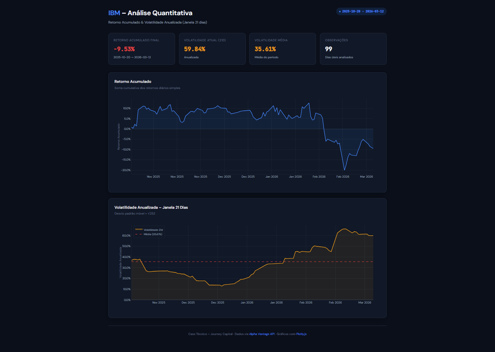

# Case Técnico – IBM · Análise Quantitativa de Ativo

> Pipeline Python que consome a API Alpha Vantage para o ativo **IBM**, calcula métricas financeiras quantitativas e exibe os resultados em um dashboard interativo com Plotly.js.

---

## Preview



---

## Destaques

- **Zero dependências de análise** — cálculos implementados com a stdlib Python (`math`, `statistics`), sem pandas ou numpy
- **Decisões técnicas justificadas** — cada escolha metodológica (retorno simples vs. logarítmico, soma aritmética, janela 21d) está documentada com embasamento
- **Dashboard interativo e responsivo** — Plotly.js com KPIs dinâmicos, zoom, hover unificado e tema dark
- **Pipeline com feedback de progresso** — saída estruturada em 4 etapas para facilitar rastreamento e debug
- **Testes unitários com valores controlados** — cobertura das funções de cálculo com dados determinísticos e tolerância de ponto flutuante via `math.isclose`

---

## Estrutura do Projeto

```
CaseTecnico/
├── main.py                    # Pipeline: extração, processamento e exportação
├── test_main.py               # Testes unitários das funções de cálculo
├── index.html                 # Dashboard interativo (Plotly.js)
├── assets/
│   └── dashboard.png          # Screenshot do dashboard
├── retorno_acumulado.json     # Gerado pelo main.py
└── volatilidade.json          # Gerado pelo main.py
```

---

## Como Executar

### 1. Instalar dependências

```bash
pip install requests
```

> Apenas `requests` é necessário. Os cálculos utilizam exclusivamente a biblioteca padrão Python.

### 2. Rodar o pipeline

```bash
python main.py
```

Saída esperada:

```
============================================================
Case Técnico - IBM (Alpha Vantage)
============================================================

[1/4] Buscando dados da API Alpha Vantage
      Recebidos N registros diários...
[2/4] Extraindo e ordenando preços do fechamento...
      Período: YYYY-MM-DD -> YYYY-MM-DD
[3/4] Calculando retornos e volatilidade...
[4/4] Salvando arquivos JSON...

Pipeline concluída com sucesso!
```

Isso gera `retorno_acumulado.json` e `volatilidade.json` na raiz do projeto.

### 3. Visualizar o dashboard

O HTML usa `fetch()` para carregar os JSONs — navegadores bloqueiam requisições `file://`, então é necessário um servidor HTTP local:

```bash
python -m http.server 8000
```

Acesse: [http://localhost:8000/index.html](http://localhost:8000/index.html)

---

## Pipeline de Dados (`main.py`)

### `fetch_data()`
Realiza `GET` na API Alpha Vantage e retorna o dicionário `Time Series (Daily)`.
- Lança `requests.HTTPError` se o status HTTP não for 200
- Lança `KeyError` se a chave esperada não existir na resposta (ex: limite de rate atingido)

### `extract_sorted_closes(raw_series)`
Extrai o preço de fechamento (`4. close`) de cada registro e retorna uma lista de tuplas `(data, preço)` ordenada cronologicamente — do pregão mais antigo ao mais recente.

### `compute_daily_returns(closes)`
Calcula a variação percentual simples entre dias consecutivos:

$$r_t = \frac{P_t - P_{t-1}}{P_{t-1}}$$

Retorna uma lista `(data, retorno)` a partir do segundo pregão.

### `compute_cumulative_returns(daily_returns)`
Soma aritmética cumulativa dos retornos diários ao longo do tempo:

$$R_t = \sum_{i=1}^{t} r_i$$

### `compute_annualized_volatility(daily_returns, window=21)`
Volatilidade anualizada em janela móvel de 21 dias úteis:

$$\sigma_t^{anual} = \text{std}(r_{t-20}, \ldots, r_t) \times \sqrt{252}$$

O fator `√252` anualiza o desvio padrão diário com base nos dias úteis convencionais do mercado americano.

### `save_to_json(data, filepath, value_key)`
Serializa a lista de `(data, valor)` para JSON no formato:

```json
[
  { "date": "2024-01-02", "retorno_acumulado": 0.012345 },
  ...
]
```

---

## Decisões Técnicas

### Retorno Simples vs. Logarítmico
Foi utilizado o **retorno simples** `(P_t − P_{t−1}) / P_{t−1}`. O enunciado define explicitamente "variação percentual do fechamento de um dia para o próximo", o que corresponde ao retorno aritmético simples — não ao retorno logarítmico `ln(P_t / P_{t−1})`, que seria mais adequado para composição contínua ou normalidade estatística, mas não é o que foi especificado.

### Retorno Acumulado por Soma Aritmética
O enunciado pede "soma cumulativa dos retornos diários". Foi implementada a soma aritmética acumulada conforme especificado. Uma alternativa seria o produto cumulativo `(1 + r_1)(1 + r_2)... − 1`, que considera o efeito de capitalização — mas isso extrapola o que foi solicitado.

### Volatilidade como Série Temporal
A volatilidade é calculada como série temporal com uma entrada por dia (a partir do 21º pregão), permitindo visualizar a evolução do risco ao longo do tempo, não apenas um valor pontual. O desvio padrão amostral (`statistics.stdev`) é usado sobre cada janela de 21 dias e anualizado por `√252`.

### Biblioteca Padrão Python
Os cálculos utilizam apenas `math` e `statistics` da stdlib, sem dependência de pandas ou numpy. Isso mantém o projeto leve, sem instalações extras além de `requests`, e demonstra compreensão dos algoritmos subjacentes — não apenas uso de APIs de alto nível.

---

## Dashboard (`index.html`)

- **Tema dark** com design system próprio (CSS custom properties, DM Sans + JetBrains Mono)
- **4 KPIs dinâmicos**: retorno acumulado final (colorido por sinal), volatilidade atual, volatilidade média e número de observações
- **Carregamento paralelo** dos dois JSONs via `Promise.all`
- **Gráfico de Retorno Acumulado** — série temporal com área preenchida (Plotly.js)
- **Gráfico de Volatilidade Anualizada** — janela móvel 21d com linha de média sobreposta em tracejado
- **Estados de loading e erro** tratados com spinner animado e mensagens descritivas
- **Responsivo** — layout adaptado para mobile via media queries

---

## Testes (`test_main.py`)

Validação das funções principais com dados controlados e determinísticos:

```bash
python test_main.py
```

**22 testes** organizados em 6 classes, um por função:

| Classe de teste | Função coberta | Casos |
|---|---|---|
| `TestFetchData` | `fetch_data` | Resposta válida, `KeyError` em chave ausente, `RequestException` em falha de rede |
| `TestExtractSortedCloses` | `extract_sorted_closes` | Ordenação cronológica, conversão para `float`, entrada única |
| `TestComputeDailyReturns` | `compute_daily_returns` | Comprimento `n-1`, retorno positivo e negativo, exclusão da primeira data |
| `TestComputeCumulativeReturns` | `compute_cumulative_returns` | Soma acumulada, preservação de datas, retornos negativos, entrada única |
| `TestComputeAnnualizedVolatility` | `compute_annualized_volatily` | Comprimento da saída, valor analítico conhecido, série constante (vol=0), data correta da janela, janela padrão 21d |
| `TestSaveToJson` | `save_to_json` | Estrutura e valores do JSON, chave customizada, JSON válido |

`fetch_data` é testada com `unittest.mock.patch` — sem chamadas reais à API. Todos os asserts numéricos usam `math.isclose` para tolerância de ponto flutuante.

---

## Tecnologias

| Tecnologia | Uso |
|---|---|
| Python 3 | Pipeline de extração, processamento e exportação |
| `requests` | Requisição HTTP à API Alpha Vantage |
| `math` / `statistics` | Cálculos financeiros (stdlib, sem dependências extras) |
| Plotly.js | Gráficos interativos no browser |
| HTML / CSS / JS | Dashboard frontend com tema dark responsivo |

---

## Fonte dos Dados

[Alpha Vantage API](https://www.alphavantage.co) — endpoint `TIME_SERIES_DAILY`, símbolo `IBM`, chave `demo`.
